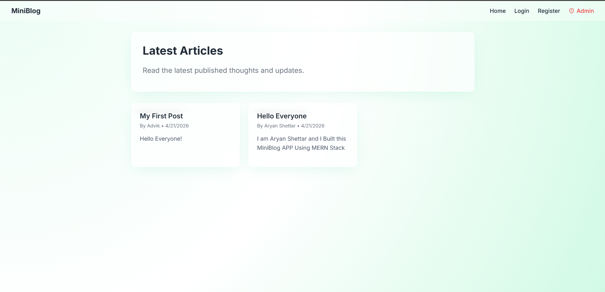
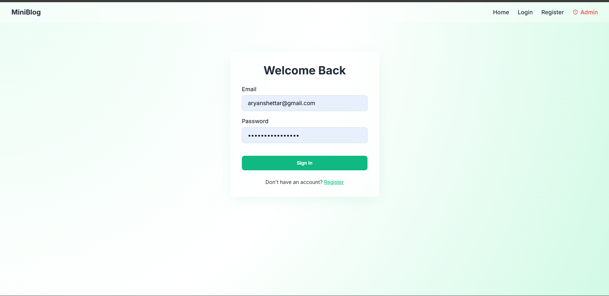
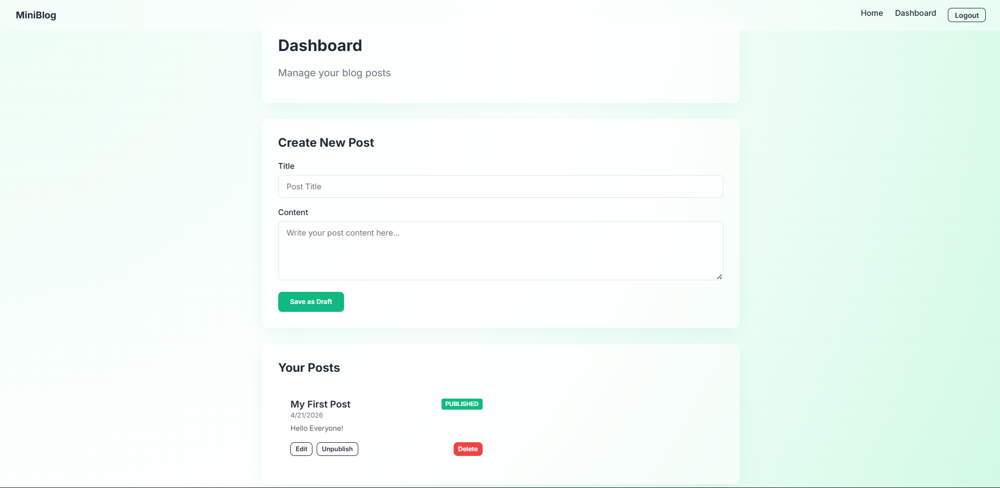
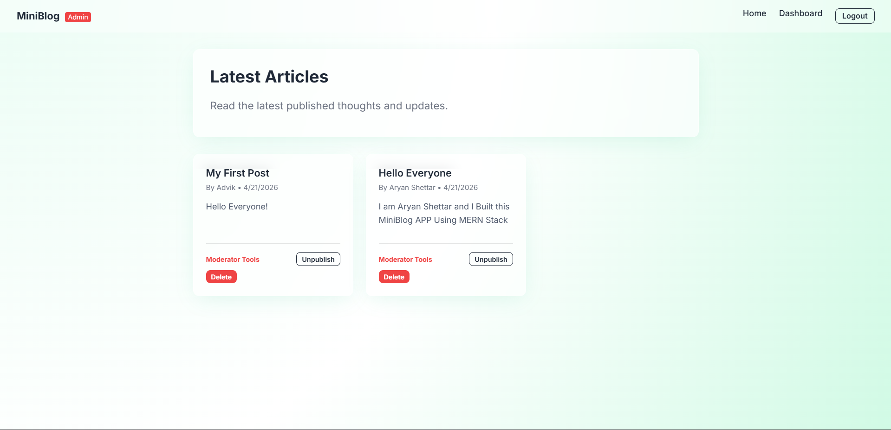
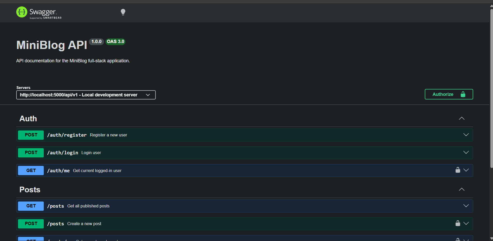

# MiniBlog API

A production-ready full-stack application demonstrating secure authentication, role-based access control, and scalable REST API design.

## 🚀 Live Deployments
- **Frontend Live URL (Netlify):** [https://primeminiblog.netlify.app/](https://primeminiblog.netlify.app/)
- **Backend API (Render):** [https://miniblog-jtuz.onrender.com/](https://miniblog-jtuz.onrender.com/)
- **Swagger Docs:** [https://miniblog-jtuz.onrender.com/api-docs](https://miniblog-jtuz.onrender.com/api-docs)

## 📸 Project Previews

### Public Home Feed (Published Posts)


### User & Admin Login UI


### User Dashboard (CRUD Operations)


### Admin Dashboard (Moderation Tools)


### Automatically Generated API Documentation


---

## 🏗️ Project Structure
- **/backend**: Node.js, Express, MongoDB API
- **/frontend**: React.js (Vite) User Interface

## 🚀 Features
- **Secure Authentication**: JWT-based auth combined with bcrypt password hashing.
- **Role-Based Access Control**: Discrete `admin` and `user` roles ensuring strict content moderation policies.
- **RESTful Architecture**: Complete set of CRUD operations for Blog Posts.
- **Interactive Documentation**: Swagger UI docs exposed at `/api-docs`.
- **Elegant UI**: Tailored glassmorphism user interface using a premium emerald green aesthetic.
- **Robust Error Handling**: Dedicated API error middleware enforcing strict JSON schemas on failure.

## 🌐 Architecture & Scalability Notes
- **Modular Structure**: Seperated cleanly into config, controllers, routes, models, and utils for horizontal code growth.
- **Microservices Ready**: Easily split into Auth and Post services using an API Gateway handling auth resolution.
- **Load Balancing**: Fully stateless architecture using JWTs. Can comfortably run behind load balancers like NGINX dynamically.
- **Caching**: Endpoints like `GET /api/v1/posts` are perfect candidates for Redis caching under heavier traffic loads.
- **Database**: Mongoose powered with straightforward expansion for composite indexing on schemas.

---

## 🛠️ Setup Instructions

### Backend
1. Open a terminal and navigate to the backend directory:
   ```bash
   cd backend
   ```
2. Install dependencies:
   ```bash
   npm install
   ```
3. Copy `.env.example` to `.env` and fill in your `MONGODB_URI` along with your JWT secrets.
4. Launch the local dev server:
   ```bash
   npm run dev
   ```
5. Visit `http://localhost:5000/api-docs` to interact with the API endpoints!

### Frontend
1. Open a *new* terminal and navigate to the frontend directory:
   ```bash
   cd frontend
   ```
2. Install dependencies:
   ```bash
   npm install
   ```
3. (Optional) Create an `.env` file and set `VITE_API_URL=http://localhost:5000/api/v1` if you plan to change the backend port.
4. Launch the Vite dev server:
   ```bash
   npm run dev
   ```

## 📦 Postman Collection
Import the provided `postman_collection.json` file found in the root directory into your Postman workspace for quick endpoint testing.
